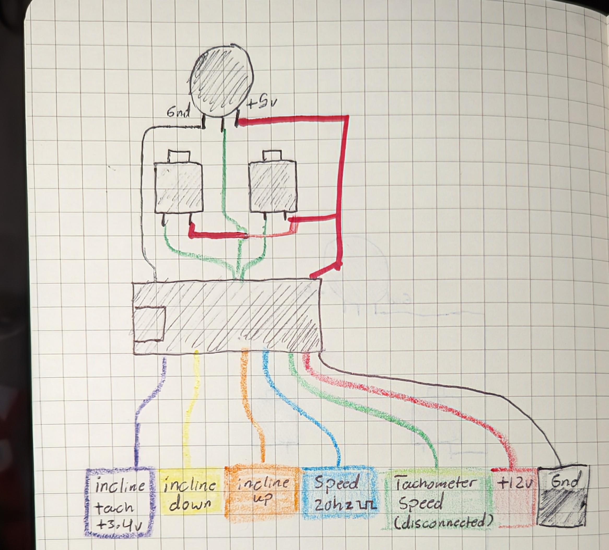

# Arduinifit
Arduinifit is a firmware to control the iFit Proform Pro 5000 (and probably other) treadmills using the original motor drivers. 

# About
The iFit Proform Pro 5000 is made of 3 primary components:
- Motor hardware (elevation and speed) 
- Motor driver (MC2100, one driver for incline and speed)
- Controller
- Buttons
- Tablet (Android 2.0)

The tablet is most likely to fail since it receives periodic updates and they want you to "upgrade" (is a second running machine really an upgrade though?) as frequently as possible. The controller board communicates with it over UART, but I haven't been able to decipher its inner protocols. Most of the buttons are wired to it in a matrix, so it will be hard to reuse them without the UART connection. It connects directly to the motor driver. 

## The motor driver
The motor driver is controlled and sends feedback over a few wires. On the motor driver, each wire is labelled with a letter: 
| Wire/ Driver Pin          | Purpose      | Explanation
| ------------------| -------------|------------
| (G) Black/White   | Ground       | 
| (S) Purple        | Incline Sense| Pulses each rotation of incline screw.  
| (U) Yellow        | Incline Down | Turns on at ~5v *if* Up is gnd (0v)
| (D) Orange        | Incline Up   | Turns on at ~5v *if* Down is gnd (0v)
| (P) Blue          | Speed        | PWM 20hz (19.5hz to 20.5hz)
| (T) Green         | Tachometer   | Not connected. Future use?
| (9) Red           | +12v         | 9v, 12v... close enough, I guess
| (G) Black         | Ground       | 

It should be noted that Incline Sense doesn't use absolute positioning, so I can only guess that the original tablet kept track of the incline and saved it to memory for when it was turned off. The Arduino doesn't have memory, so this won't work for us. For now, just take note when it stops moving. 

Incline up and down *must* be pulled low by default, and both must be connected or neither will work. Setting each Arduino pin to 0 at start will suffice. 

*Wiring diagram. Use the Arduino pins described in the comment in the code.*

# Setup
## Parts
- Arduino
- Broken Treadmill with a compatible controller
- 5k potentiometer
- 2 keyboard switches
- Some wiring

## Arduino Installation

1. Open `arduinifit` file in the Arduino IDE and upload it to your Arduino.

2. Wire Arduino controls as in the diagram, using the pins named in the code.
    - 5k potentiometer connected to gnd, Arduino analog in, and 5v
    - Buttons connected to ground and Arduino inputs

## Identifying Motor Driver Pins
Not all motor controllers will be the same. To identify each pin:
1. Start by finding ground and 12v with a multimeter. Otherwise you'll fry something. Touch each other pin and note any outputting power. If any are outputting 3.3v-5v, you may have found the incline sense and/or speed tachometer, if connected.

2. Next, switch to the ohmmeter setting and touch each pin. Note any connections near 0 ohms (that aren't ground) as these are probably outputs pulled low. You may have found the incline sense and/or speed tachometer, if connected. 

*--- You should now know Incline Sense, Speed Tachometer, 12v, Gnd ---*

3. Next, upload the code to the Arduino and turn up the speed at least halfway. This will start the 20hz PWM signal. Check with the multimeter. It should either fluctuate voltage or read a constant ~2.5-4 volts. 
    - If it's 0v, turn up the potentiometer and check your connections. 
    - If it's above 4.5v, turn the power down. 

4. Connect Arduino ground to driver ground. 

5. Touch the 20hz Arduino pin to each pin that hasn't been identified and hold it there at least 5 seconds or until something happens.
    - If the speed turns on, congratulations! 
    - If the incline changes, note the direction
    - If none of the pins respond, check your connections and turn the speed up/down. Check that the potentiometer is connected to both ground and 5v on the Arduino. 

*--- You should now know treadmill Power/Speed ---*

6. Apply 5v to the remaining connections one at a time to identify Incline Up and Down. 

*--- You should now know Incline Up and Down ---*

### Pinout and identifiers

| Driver Pin/Wire  | Identification
| -----------------|---------------
| (G) Ground       | You know how to find this. 0v, ~0 ohms.
| (S) Incline Sense| Output. Either 3.3v or 0 ohms. *Try voltage first!*
| (U) Incline Down | Input. 0v out, but not ~0 ohms. Apply 5v to turn on
| (D) Incline Up   | Input. 0v out, but not ~0 ohms, Apply 5v to turn on
| (P) Speed        | Input. 0v out, but not ~0 ohms. Apply PWM 20hz (19.5hz to 20.5hz) for 5 seconds to turn on.
| (T) Tachometer   | Output. Not connected/infinite Ohms or same as incline sense.
| (9) +12v         | 12v. 
| (G) Ground       | 

# Contributing
If you want to contribute (not that this is super niche...) feel free to write up an issue and fork the code. If you want to try another treadmill, put in an issue with the treadmill model, a picture of the board if available (close up on the pins is useful), and the board serial number. You can update progress there and I'll put whatever changes are needed on this end to make it easier. 

Here's the wokwi simulation I use for debugging, using LEDs instead of motors: https://wokwi.com/projects/393810925685210113

# TODO
- [ ] Safety key support
- [ ] Display to show current speed and incline
- [ ] Serial control and status
- [ ] Incline angle? Explore this. 
- [ ] Detect if walking stopped using an accelerometer
